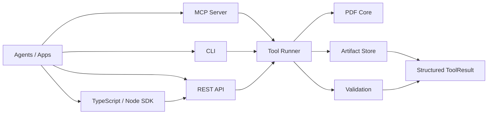

<p align="center">
  
</p>

<h1 align="center">okpdf</h1>

<p align="center">
  Local-first, agent-native PDF infrastructure for CLI, MCP, REST, and self-hosted workflows.
</p>

<p align="center">
  <a href="https://github.com/tover0314-w/okpdf"></a>
  
  
  
  
  
  
</p>

okpdf is building the open-source foundation for agent-readable PDF operations: inspect, organize, render, extract text and images, edit metadata, validate outputs, and expose everything through local interfaces that coding agents can call safely.

The public CLI is `okpdf`. The legacy/internal command `agentpdf` still works for compatibility. The TypeScript/Node package lives at `packages/agentpdf-node` and is named `@okpdf/agentpdf-node`.

## Why Star This

- Complete public tool map from day one: 160+ planned namespaces are discoverable now.
- Local-first by default: no hosted URL, paid key, or cloud dependency required.
- Agent-first outputs: every tool returns structured JSON with artifacts, validation, warnings, and next recommended tools.
- MCP, REST, and TypeScript ready: Claude Code, Claude Desktop, Cursor, Codex-style agents, Node scripts, and web apps can call the same tool layer.
- Safety-minded PDF workflow: explicit paths, no input mutation, path traversal rejection, metadata removal, and validation for generated PDFs.
- License-safe core: default dependencies avoid GPL/AGPL.

## What Works Today

| Family | Tools | Interfaces |
|---|---|---|
| Inspect | document and page-level facts, including text/image/render evidence | CLI, MCP, REST, Node.js |
| Organize | merge, split, extract/remove/reorder/rotate pages, insert blank pages | CLI, MCP, REST |
| Optimize | content-stream compression, parseable PDF repair/rewrite | CLI, MCP, REST, Node.js |
| Convert | image/Markdown/Text to PDF, render pages to images, extract text and embedded images | CLI, MCP, REST, Node.js |
| Edit | text watermark, page numbers | CLI, MCP, REST |
| Metadata | read, update, remove | CLI, MCP, REST |
| Validation | generated PDF validation, render check, blank page check | CLI, MCP, REST |
| AI-lite | local Document IR parse, PDF-to-JSON/Markdown, local RAG ingest/query with citations | CLI, MCP, REST |
| Workflow | local-first agent workflow planning, execution, and reporting with per-step evidence | CLI, MCP, REST, Node.js |
| SDK | TypeScript/Node REST client and Node CLI wrappers | Node.js |
| Discovery | complete tool manifest | CLI, MCP, REST, Node.js |

Planned next local tools include crop/resize, forms, attachments, richer repair diagnostics, better table parsing, visual diff, and redaction verification.

## Install

```bash
git clone git@github.com:tover0314-w/okpdf.git
cd okpdf
python scripts/setup_dev.py
```

## Quickstart

```bash
python scripts/doctor.py
python scripts/smoke.py
okpdf tools list
okpdf create text "Hello from okpdf" -o .agentpdf-out/hello.pdf --json
```

That is the happy path: install, check the environment, generate a validated PDF.

## Docker

Run the local REST API in a container:

```bash
docker build -t okpdf/local:dev .
docker run --rm -p 7331:7331 -v "$PWD:/workspace" okpdf/local:dev
curl http://127.0.0.1:7331/healthz
```

Or use Compose:

```bash
docker compose up --build
```

The image runs as a non-root user, disables cloud/model calls by default, and exposes the same local REST API that MCP and the TypeScript SDK use.

Common commands:

```bash
okpdf inspect tests/fixtures/simple.pdf --json
okpdf inspect-pages tests/fixtures/text.pdf --pages 1 --render-check --json
okpdf workflow plan --goal "Chat with this PDF and cite answers" --input-path .agentpdf-out/numbered.pdf --json
okpdf workflow run examples/workflows/local-rag.json --json
okpdf workflow run .agentpdf-out/plan.json --artifact-dir .agentpdf-out/workflows/chat --binding "<question>=What does this document say?" --binding "<answer>=This document is locally indexed." --json
okpdf workflow report .agentpdf-out/run-result.json -o .agentpdf-out/workflow-report.md --json
okpdf merge tests/fixtures/simple.pdf tests/fixtures/two_pages.pdf -o .agentpdf-out/merged.pdf --json
okpdf reorder-pages .agentpdf-out/merged.pdf --order 3,1,2 -o .agentpdf-out/reordered.pdf --json
okpdf insert-blank-pages .agentpdf-out/reordered.pdf --after-page 1 --count 1 -o .agentpdf-out/with-blank.pdf --json
okpdf compress .agentpdf-out/with-blank.pdf -o .agentpdf-out/with-blank-compressed.pdf --json
okpdf repair .agentpdf-out/with-blank-compressed.pdf -o .agentpdf-out/with-blank-repaired.pdf --json
okpdf image-to-pdf cover.png -o .agentpdf-out/cover.pdf --json
okpdf create markdown examples/sample-documents/business_report.md -o .agentpdf-out/business-report.pdf --style-pack business_report_modern --json
okpdf watermark .agentpdf-out/cover.pdf --text "CONFIDENTIAL" -o .agentpdf-out/watermarked.pdf --json
okpdf page-numbers .agentpdf-out/watermarked.pdf --template "Page {page} of {total}" -o .agentpdf-out/numbered.pdf --json
okpdf render tests/fixtures/simple.pdf --pages 1 --format png --out-dir .agentpdf-out/renders --json
okpdf extract-images .agentpdf-out/numbered.pdf --pages all --out-dir .agentpdf-out/extracted-images --json
okpdf extract-text tests/fixtures/text.pdf --pages 1 --json
okpdf metadata remove tests/fixtures/metadata.pdf -o .agentpdf-out/metadata-clean.pdf --json
okpdf validate .agentpdf-out/numbered.pdf --expected-pages 1 --json
okpdf render-check .agentpdf-out/numbered.pdf --pages 1 --json
okpdf blank-page-check .agentpdf-out/with-blank.pdf --pages all --json
okpdf parse-lite .agentpdf-out/numbered.pdf --json
okpdf pdf-to-json .agentpdf-out/numbered.pdf -o .agentpdf-out/numbered.ir.json --json
okpdf pdf-to-markdown .agentpdf-out/numbered.pdf -o .agentpdf-out/numbered.md --json
okpdf rag ingest .agentpdf-out/numbered.pdf --index .agentpdf-out/numbered.index.json --json
okpdf rag chat .agentpdf-out/numbered.pdf --question "What does this document say?" --report-output .agentpdf-out/numbered-chat-report.pdf --highlight-output .agentpdf-out/numbered-chat-highlighted.pdf --json
okpdf rag query .agentpdf-out/numbered.index.json --query "What does this document say?" --json
okpdf rag search .agentpdf-out/numbered.index.json --query "document" --json
okpdf rag cite-answer .agentpdf-out/numbered.index.json --answer "This document is locally indexed." --json
okpdf rag highlight-sources .agentpdf-out/numbered.index.json --answer "This document is locally indexed." -o .agentpdf-out/numbered-highlighted.pdf --json
okpdf rag export-report .agentpdf-out/numbered.index.json --question "What does this document say?" --answer "This document is locally indexed." -o .agentpdf-out/numbered-rag-report.pdf --json
```

## TypeScript / Node.js

Run the Python REST server, then call it from TypeScript or Node:

```bash
okpdf serve --api
node packages/agentpdf-node/dist/src/cli.js tools
node packages/agentpdf-node/dist/src/cli.js create-text --text "Hello Node" -o .agentpdf-out/node.pdf
```

SDK usage:

```ts
import { AgentPDFClient } from "@okpdf/agentpdf-node";

const client = new AgentPDFClient({ baseUrl: "http://127.0.0.1:7331" });
const result = await client.createMarkdownPdf({
  markdown: "# Agent Report\n\n- Local first\n- TypeScript ready",
  outputPath: ".agentpdf-out/report.pdf",
  stylePack: "business_report_modern",
});
const pageFacts = await client.inspectPages({
  inputPath: ".agentpdf-out/report.pdf",
  pages: "1",
  renderCheck: true,
});

await client.watermark({
  inputPath: ".agentpdf-out/report.pdf",
  text: "DRAFT",
  outputPath: ".agentpdf-out/report-draft.pdf",
});

console.log(pageFacts.usage.pages);
console.log(result.artifacts[0]?.path);
```

## Agent Interfaces

### MCP

Run a local stdio MCP server:

```bash
okpdf serve --mcp --safe-root .
```

Example config:

```json
{
  "mcpServers": {
    "agentpdf": {
      "command": "okpdf",
      "args": ["serve", "--mcp", "--safe-root", "."]
    }
  }
}
```

MCP tools currently exposed:

- `agentpdf_tool_manifest`
- `pdf_inspect_document`
- `pdf_inspect_pages`
- `pdf_workflow_plan`
- `pdf_workflow_run`
- `pdf_workflow_report`
- `pdf_merge`
- `pdf_split`
- `pdf_extract_pages`
- `pdf_remove_pages`
- `pdf_rotate_pages`
- `pdf_reorder_pages`
- `pdf_insert_blank_pages`
- `pdf_optimize_compress`
- `pdf_optimize_repair`
- `pdf_image_to_pdf`
- `pdf_watermark`
- `pdf_add_page_numbers`
- `pdf_create_text`
- `pdf_create_markdown`
- `pdf_render_pages`
- `pdf_extract_images`
- `pdf_extract_text`
- `pdf_pdf_to_json`
- `pdf_pdf_to_markdown`
- `pdf_metadata_read`
- `pdf_metadata_update`
- `pdf_metadata_remove`
- `pdf_validate_output`
- `pdf_render_check`
- `pdf_blank_page_check`
- `pdf_ai_parse_lite`
- `pdf_ai_rag_ingest`
- `pdf_ai_rag_chat`
- `pdf_ai_rag_cite_answer`
- `pdf_ai_rag_export_report`
- `pdf_ai_rag_highlight_sources`
- `pdf_ai_rag_query`
- `pdf_ai_rag_search`

### REST

Run the local HTTP API:

```bash
okpdf serve --api
```

Useful endpoints:

```text
GET  /healthz
GET  /v1/tools
GET  /v1/tools/{tool_name}
POST /v1/tools/{tool_name}/run
GET  /v1/jobs/{job_id}
GET  /v1/artifacts/{artifact_id}
GET  /v1/artifacts/{artifact_id}/download
```

Example:

```bash
curl -X POST http://127.0.0.1:7331/v1/tools/pdf.inspect.document/run \
  -H 'Content-Type: application/json' \
  -d '{"path": "tests/fixtures/simple.pdf"}'
```

Inspect page facts with render evidence:

```bash
curl -X POST http://127.0.0.1:7331/v1/tools/pdf.inspect.pages/run \
  -H 'Content-Type: application/json' \
  -d '{"input_path": "tests/fixtures/text.pdf", "pages": "1", "render_check": true}'
```

Extract embedded images:

```bash
curl -X POST http://127.0.0.1:7331/v1/tools/pdf.convert.extract_images/run \
  -H 'Content-Type: application/json' \
  -d '{"input_path": ".agentpdf-out/report.pdf", "pages": "all", "out_dir": ".agentpdf-out/extracted-images"}'
```

Plan an agent workflow:

```bash
curl -X POST http://127.0.0.1:7331/v1/tools/pdf.workflow.plan/run \
  -H 'Content-Type: application/json' \
  -d '{"goal": "Chat with this PDF and cite answers", "input_path": ".agentpdf-out/report.pdf"}'
```

Run a local workflow manifest:

```bash
curl -X POST http://127.0.0.1:7331/v1/tools/pdf.workflow.run/run \
  -H 'Content-Type: application/json' \
  -d '{"workflow":{"steps":[{"step_id":"inspect","tool":"pdf.inspect.document","input":{"path":".agentpdf-out/report.pdf"}}]}}'
```

`pdf.workflow.run` can also consume the full JSON returned by `pdf.workflow.plan`; pass runtime values under `bindings` for placeholders such as `<question>` and `<answer>`, and set `artifact_dir` when the runner should auto-create paths like `<output.index.json>`.

Create a PDF from Markdown:

```bash
curl -X POST http://127.0.0.1:7331/v1/tools/pdf.convert.markdown_to_pdf/run \
  -H 'Content-Type: application/json' \
  -d '{"markdown": "# Agent Report\n\n- Local first\n- MCP ready", "output_path": ".agentpdf-out/report.pdf"}'
```

Compress a PDF:

```bash
curl -X POST http://127.0.0.1:7331/v1/tools/pdf.optimize.compress/run \
  -H 'Content-Type: application/json' \
  -d '{"input_path": ".agentpdf-out/report.pdf", "output_path": ".agentpdf-out/report-compressed.pdf"}'
```

## Tool Result Contract

Every public tool returns the same shape:

```json
{
  "job_id": "job_...",
  "status": "succeeded",
  "tool": "pdf.organize.merge",
  "artifacts": [],
  "validation": {},
  "warnings": [],
  "usage": {},
  "next_recommended_tools": []
}
```

Generated PDFs include artifact metadata and validation checks such as parseability and page count.

## Architecture



Core code lives under `src/agentpdf`:

- `core/`: deterministic PDF operations.
- `tools/`: registry and runner wrappers.
- `schemas/`: Pydantic public contracts.
- `artifacts/`: local artifact metadata.
- `validation/`: generated output validation.
- `cli/`: Typer CLI.
- `mcp/`: FastMCP server.
- `api/`: FastAPI local REST server.
- `security/`: path safety helpers.

## Open-Source Direction

okpdf is inspired by mature open-source document processing projects such as pdf-craft, Docling, Marker, Unstructured, and local-first PDF tooling. The project borrows architectural ideas, not implementation code:

- local/offline document processing;
- handler boundaries for reading, rendering, extraction, OCR, and output writing;
- optional heavyweight workers with explicit dependency and cache locations;
- per-page warnings and partial-failure reporting;
- cloud/model functionality as an explicit layer above the local core.

## Roadmap

- Lite document parse and local RAG demo.
- More creation inputs and style packs.
- More deterministic operations: cropping, forms baseline, metadata page info, attachments, and safe redaction helpers.
- Richer validation: repair diagnostics, page visual diff, redaction verification.
- Docker and self-hosted examples.
- Cloud worker boundary for advanced OCR, agentic parse, and hosted batch jobs.

## Development

```bash
python scripts/setup_dev.py
pytest -q
npm test --workspace @okpdf/agentpdf-node
ruff check src tests scripts
```

This workspace currently has no required cloud service for local development.

## Reference Projects

The project intentionally studies mature PDF/document tooling such as [pypdf](https://github.com/py-pdf/pypdf), [qpdf](https://github.com/qpdf/qpdf), [pdfcpu](https://github.com/pdfcpu/pdfcpu), [pdfplumber](https://github.com/jsvine/pdfplumber), [OCRmyPDF](https://ocrmypdf.readthedocs.io/), [Docling](https://github.com/docling-project/docling), [Marker](https://github.com/VikParuchuri/marker), and [Stirling-PDF](https://github.com/Stirling-Tools/Stirling-PDF). The synthesis lives in [docs/33_REFERENCE_PROJECT_SYNTHESIS.md](docs/33_REFERENCE_PROJECT_SYNTHESIS.md).

The larger agent-infra and cloud strategy lives in [docs/34_AGENT_INFRA_AI_CLOUD_STRATEGY.md](docs/34_AGENT_INFRA_AI_CLOUD_STRATEGY.md).

## License

Apache-2.0. See [LICENSE](LICENSE).
