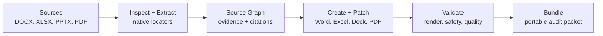

<p align="center">
  
</p>

<h1 align="center">OKoffice</h1>

<p align="center">
  Agent-native Office infrastructure for Word, Excel, PowerPoint, PDF, and audit-ready document workflows.
</p>

<p align="center">
  <a href="https://github.com/tover0314-w/OKoffice/actions/workflows/ci.yml"></a>
  <a href="https://github.com/tover0314-w/OKoffice/blob/main/LICENSE"></a>
  
  
  
  
</p>

<p align="center">
  <a href="#why-okoffice">Why</a>
  |
  <a href="#quickstart">Quickstart</a>
  |
  <a href="#what-works-today">Status</a>
  |
  <a href="#tool-surface">Tools</a>
  |
  <a href="#docs-map">Docs</a>
  |
  <a href="README.zh-CN.md">Simplified Chinese</a>
</p>

OKoffice is the open-source foundation for agents that need to read, extract, create, edit, validate, cite, and bundle Office artifacts. It treats documents as structured, source-mapped systems: Word paragraphs and tables, Excel cells and formulas, PowerPoint slides and notes, PDF pages and bboxes, plus the evidence graph that connects them.

The previous project identity, `agentpdf` / `okpdf`, is now the PDF compatibility layer inside OKoffice. Existing `pdf.*` tools stay stable while the broader `office.*`, `word.*`, `sheet.*`, and `deck.*` tool surface grows.

## Why OKoffice

Most document automation stops at file conversion or text extraction. OKoffice is built for agent workflows where every operation needs a contract:

- **Agent-first outputs**: every tool returns structured `ToolResult` JSON with artifacts, validation, warnings, usage, and next recommended tools.
- **Native locators**: source refs use real document coordinates such as table cells, workbook cells, slides, pages, bboxes, comments, and formulas.
- **Local-first by default**: CLI, MCP, REST, and SDK workflows run locally without a hosted account.
- **Validation as a primitive**: generated and transformed artifacts should carry renderability, safety, source-map, and quality evidence.
- **Explicit cloud boundary**: hosted OKoffice can add managed workers, connectors, batch orchestration, and governance without becoming a hidden OSS dependency.



## Quickstart

```bash
git clone git@github.com:tover0314-w/OKoffice.git
cd OKoffice

python scripts/setup_dev.py
okoffice version
okoffice tools show word.extract.tables --json
pytest tests/unit/test_office_table_extract.py -q
```

Try the current local interfaces:

```bash
okoffice inspect path/to/report.docx --json
okoffice word inspect path/to/report.docx --json
okoffice word extract-tables path/to/report.docx --json
okoffice sheet inspect path/to/model.xlsx --json
okoffice sheet read path/to/model.xlsx --max-rows 100 --json
okoffice sheet profile path/to/model.xlsx --json
okoffice sheet extract-tables path/to/model.xlsx --json
okoffice sheet create-evidence-workbook records.json -o .okoffice-out/evidence.xlsx --json
okoffice sheet write-workbook records.json -o .okoffice-out/model.xlsx --json
okoffice sheet validate .okoffice-out/model.xlsx --json
okoffice sheet validate-formulas .okoffice-out/model.xlsx --json
okoffice deck inspect path/to/deck.pptx --json
okoffice deck compose-plan .okoffice-out/evidence.xlsx -o .okoffice-out/deck.plan.json --title "Board Review" --json
okoffice deck create-from-outline outline.json -o .okoffice-out/board-review.pptx --json
okoffice deck validate .okoffice-out/board-review.pptx --json
okoffice context build --file path/to/report.docx --file path/to/model.xlsx -o .okoffice-out/context.packet.json --json
okoffice extract schema .okoffice-out/context.packet.json --schema examples/schemas/vendor-renewal.json -o .okoffice-out/evidence.json --json
okoffice validate package path/to/report.docx --json
okoffice workflow extract-to-sheet --context-packet .okoffice-out/context.packet.json -o .okoffice-out/evidence.xlsx --json
okoffice workflow extract-to-sheet path/to/report.docx path/to/model.xlsx -o .okoffice-out/evidence.xlsx --json
okoffice workflow sheet-to-deck .okoffice-out/evidence.xlsx -o .okoffice-out/board-review.pptx --title "Board Review" --json
okoffice workflow board-pack .okoffice-out/evidence.xlsx .okoffice-out/board-review.pptx -o .okoffice-out/board-pack.zip --title "Board Review" --json
okoffice bundle verify .okoffice-out/board-pack.zip --json

okpdf inspect tests/fixtures/simple.pdf --json
okpdf serve --mcp --safe-root .
okpdf serve --api
```

## What Works Today

| Area | Status | Notes |
|---|---:|---|
| `okoffice` CLI | beta | Target manifest, planning, Office inspect, context build, table extraction, workflow, and bundle entrypoints. |
| `office.inspect.file` | beta | Detects DOCX/XLSX/PPTX/PDF/text formats and returns safety metadata. |
| `office.context.build_packet` | beta | Builds a local context packet and source graph with file/native nodes plus Word table, Excel sheet/range/formula, and PowerPoint slide nodes when available. |
| `office.extract.schema` | beta | Extracts schema-shaped evidence JSON from a context packet with source refs, coverage, and missing-field warnings. |
| `office.validation.package` | beta | Validates OOXML/PDF package baseline, unsafe ZIP entries, macro markers, and external relationships without executing embedded code. |
| `word.inspect.document` | beta | Reads DOCX structure, headings, tables, comments, styles, and safety markers. |
| `word.extract.tables` | beta | Extracts DOCX tables into normalized rows/cells with source refs. |
| `sheet.inspect.workbook` | beta | Reads workbook sheets, dimensions, formulas, tables, charts, links, and safety markers. |
| `sheet.read.workbook` | beta | Reads bounded workbook rows, cells, formulas, and source refs as agent-friendly JSON. |
| `sheet.profile.data` | beta | Profiles headers, data types, missing cells, formulas, and source coverage. |
| `sheet.extract.tables` | beta | Extracts worksheet tables with sheet, row, column, and cell refs. |
| `sheet.create.evidence_workbook` | beta | Creates auditable XLSX evidence workbooks from source-mapped records with provenance sheets. |
| `sheet.write.workbook` | beta | Writes source-mapped records into a local XLSX workbook with provenance sheets. |
| `sheet.validate.workbook` | beta | Validates XLSX structure, non-empty sheets, external links, safety markers, and SourceRefs readiness. |
| `sheet.validation.formulas` | beta | Scans formulas for cached errors, broken refs, external workbook refs, and volatile functions without recalculation. |
| `deck.inspect.presentation` | beta | Reads PPTX slide, notes, layout, theme, media, and chart facts. |
| `deck.compose.plan` | beta | Composes source-mapped, deck-specific Composition IR and outline JSON from an evidence workbook without writing a PPTX. |
| `deck.create.from_outline` | beta | Creates editable local PPTX decks from structured outlines. |
| `deck.validate.presentation` | beta | Validates PPTX structure, blank slides, placeholder leakage, safety markers, and source-map readiness. |
| `office.workflow.extract_to_sheet` | beta | Builds a source-mapped XLSX evidence workbook from DOCX/XLSX tables or an OKoffice context packet source graph. |
| `office.workflow.sheet_to_deck` | beta | Profiles an evidence workbook and creates an editable PPTX review deck. |
| `office.workflow.board_pack` | beta | Creates a local ZIP board pack with artifacts, manifest, validation report, and delivery metadata. |
| `office.bundle.verify` | beta | Verifies board pack ZIP manifests, validation reports, artifact members, sizes, and SHA-256 checksums. |
| `pdf.*` compatibility | stable/beta | The full manifest currently covers 264 local PDF, Office, and agent setup tools available through `okpdf`, MCP, REST, and SDKs. |

The codebase still exposes the compatibility Python package as `agentpdf` and the compatibility Node package as `@okpdf/agentpdf-node`. The target package identity is OKoffice; compatibility names are preserved deliberately.

## Tool Surface

| Domain | Examples |
|---|---|
| Inspect | `office.inspect.file`, `word.inspect.document`, `sheet.inspect.workbook`, `deck.inspect.presentation`, `pdf.inspect.document` |
| Extract | `word.extract.tables`, `sheet.read.workbook`, `sheet.profile.data`, `sheet.extract.tables`, `deck.extract.notes`, `pdf.convert.pdf_to_text` |
| Create | `word.write.document`, `sheet.create.evidence_workbook`, `sheet.write.workbook`, `deck.compose.plan`, `deck.create.from_outline`, `pdf.convert.markdown_to_pdf` |
| Patch | `office.patch.plan`, `word.edit.patch`, `sheet.edit.patch`, `deck.edit.patch`, `pdf.patch.apply` |
| Validate | `office.validation.run`, `word.validation.document`, `sheet.validate.workbook`, `sheet.validation.formulas`, `deck.validate.presentation`, `pdf.validation.render_check` |
| Evidence | `office.context.build_packet`, `office.evidence.coverage`, `office.source_map.create` |
| Workflow | `office.workflow.extract_to_sheet`, `office.workflow.sheet_to_deck`, `office.workflow.board_pack`, `pdf.workflow.run` |
| Bundle | `office.bundle.export`, `office.bundle.verify`, `pdf.artifacts.export_bundle` |
| Agents | `agent.setup.codex`, `agent.setup.claude_code`, `agent.setup.openclaw`, future `office.agent.setup.*` aliases |

## Agent Interfaces

OKoffice is designed to be called by coding agents and automation systems:

- CLI commands support `--json`.
- MCP tools return serialized `ToolResult` JSON.
- REST endpoints run tools through `/v1/tools/{tool_name}/run`.
- Python functions expose the same model objects.
- Node SDK compatibility remains available for the current PDF domain.
- Tool manifests document implementation status and cloud/worker boundaries.

Every public tool should return evidence, not just a boolean:

```json
{
  "job_id": "job_...",
  "status": "succeeded",
  "tool": "word.extract.tables",
  "artifacts": [],
  "validation": {"status": "passed", "checks": []},
  "warnings": [],
  "usage": {"summary": {"table_count": 1}},
  "next_recommended_tools": ["sheet.create.evidence_workbook"]
}
```

## Cloud Boundary

The open-source core stays useful locally. Hosted OKoffice can monetize managed capabilities around:

- Office rendering and conversion workers;
- OCR, multimodal parse, formula recalculation, and workbook QA;
- persistent source graphs and artifact graphs;
- managed connectors for Drive, SharePoint, Notion, Slack, email, and data warehouses;
- batch orchestration, audit retention, SSO, VPC, and enterprise governance.

Hosted features must not be required for deterministic local OSS tools.

## Docs Map

- [Product strategy](docs/37_OKOFFICE_PRODUCT_STRATEGY.md)
- [Agent-native Office PRD](docs/36_OKOFFICE_AGENT_NATIVE_OFFICE_INFRA_PRD.md)
- [Tool taxonomy](docs/38_OKOFFICE_TOOL_TAXONOMY.md)
- [Agent infrastructure](docs/40_OKOFFICE_AGENT_INFRA.md)
- [Implementation plan](docs/41_OKOFFICE_IMPLEMENTATION_PLAN.md)
- [Legacy PDF compatibility](docs/42_LEGACY_PDF_COMPATIBILITY.md)
- [Architecture](docs/03_ARCHITECTURE.md)
- [Office IR and source locators](docs/11_DOCUMENT_IR_SPEC.md)
- [Cloud business boundary](docs/39_OKOFFICE_CLOUD_BUSINESS.md)
- [Repository hygiene](docs/REPOSITORY_HYGIENE.md)

## Development

```bash
python scripts/setup_dev.py
python scripts/doctor.py
pytest -q
npm --workspace @okpdf/agentpdf-node test
ruff check src tests scripts
```

See [CONTRIBUTING.md](CONTRIBUTING.md) for pull request expectations, dependency rules, and public tool documentation requirements.

## Security

Office and PDF files are untrusted input. Do not disclose vulnerabilities, exploit details, private documents, secrets, or document-leak examples in public issues. Follow [SECURITY.md](SECURITY.md).

## License

Apache-2.0. See [LICENSE](LICENSE).
