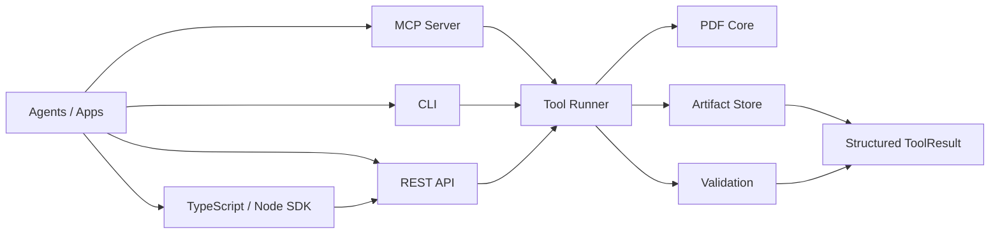

<p align="center">
  
</p>

<h1 align="center">okpdf</h1>

<p align="center">
  Local-first, agent-native PDF infrastructure for CLI, MCP, REST, and self-hosted workflows.
</p>

<p align="center">
  <a href="https://github.com/tover0314-w/okpdf"></a>
  
  
  
  
  
  
</p>

okpdf is building the open-source foundation for agent-readable PDF operations: inspect, organize, render, extract text, edit metadata, validate outputs, and expose everything through local interfaces that coding agents can call safely.

The public CLI is `okpdf`. The legacy/internal command `agentpdf` still works for compatibility. The TypeScript/Node package lives at `packages/agentpdf-node` and is named `@okpdf/agentpdf-node`.

## Why Star This

- Complete public tool map from day one: 160+ planned namespaces are discoverable now.
- Local-first by default: no hosted URL, paid key, or cloud dependency required.
- Agent-first outputs: every tool returns structured JSON with artifacts, validation, warnings, and next recommended tools.
- MCP, REST, and TypeScript ready: Claude Code, Claude Desktop, Cursor, Codex-style agents, Node scripts, and web apps can call the same tool layer.
- Safety-minded PDF workflow: explicit paths, no input mutation, path traversal rejection, metadata removal, and validation for generated PDFs.
- License-safe core: default dependencies avoid GPL/AGPL.

## What Works Today

| Family | Tools | Interfaces |
|---|---|---|
| Inspect | `pdf.inspect.document` | CLI, MCP, REST |
| Organize | merge, split, extract pages, remove pages, rotate pages | CLI, MCP, REST |
| Convert | Markdown/Text to PDF, render pages to images, extract text | CLI, MCP, REST |
| Metadata | read, update, remove | CLI, MCP, REST |
| Validation | generated PDF validation | CLI, REST-backed tool results |
| SDK | TypeScript/Node REST client and Node CLI | Node.js |
| Discovery | complete tool manifest | CLI, MCP, REST, Node.js |

Planned next local tools include lite parse, local RAG, richer validation, Docker, and more deterministic PDF operations.

## Install

```bash
git clone git@github.com:tover0314-w/okpdf.git
cd okpdf
python scripts/setup_dev.py
```

## Quickstart

```bash
python scripts/doctor.py
python scripts/smoke.py
okpdf tools list
okpdf create text "Hello from okpdf" -o .agentpdf-out/hello.pdf --json
```

That is the happy path: install, check the environment, generate a validated PDF.

Common commands:

```bash
okpdf inspect tests/fixtures/simple.pdf --json
okpdf merge tests/fixtures/simple.pdf tests/fixtures/two_pages.pdf -o .agentpdf-out/merged.pdf --json
okpdf render tests/fixtures/simple.pdf --pages 1 --format png --out-dir .agentpdf-out/renders --json
okpdf extract-text tests/fixtures/text.pdf --pages 1 --json
okpdf metadata remove tests/fixtures/metadata.pdf -o .agentpdf-out/metadata-clean.pdf --json
```

## TypeScript / Node.js

Run the Python REST server, then call it from TypeScript or Node:

```bash
okpdf serve --api
node packages/agentpdf-node/dist/src/cli.js tools
node packages/agentpdf-node/dist/src/cli.js create-text --text "Hello Node" -o .agentpdf-out/node.pdf
```

SDK usage:

```ts
import { AgentPDFClient } from "@okpdf/agentpdf-node";

const client = new AgentPDFClient({ baseUrl: "http://127.0.0.1:7331" });
const result = await client.createMarkdownPdf({
  markdown: "# Agent Report\n\n- Local first\n- TypeScript ready",
  outputPath: ".agentpdf-out/report.pdf",
});

console.log(result.artifacts[0]?.path);
```

## Agent Interfaces

### MCP

Run a local stdio MCP server:

```bash
okpdf serve --mcp --safe-root .
```

Example config:

```json
{
  "mcpServers": {
    "agentpdf": {
      "command": "okpdf",
      "args": ["serve", "--mcp", "--safe-root", "."]
    }
  }
}
```

MCP tools currently exposed:

- `agentpdf_tool_manifest`
- `pdf_inspect_document`
- `pdf_merge`
- `pdf_split`
- `pdf_extract_pages`
- `pdf_remove_pages`
- `pdf_rotate_pages`
- `pdf_create_text`
- `pdf_create_markdown`
- `pdf_render_pages`
- `pdf_extract_text`
- `pdf_metadata_read`
- `pdf_metadata_update`
- `pdf_metadata_remove`

### REST

Run the local HTTP API:

```bash
okpdf serve --api
```

Useful endpoints:

```text
GET  /healthz
GET  /v1/tools
GET  /v1/tools/{tool_name}
POST /v1/tools/{tool_name}/run
GET  /v1/jobs/{job_id}
GET  /v1/artifacts/{artifact_id}
GET  /v1/artifacts/{artifact_id}/download
```

Example:

```bash
curl -X POST http://127.0.0.1:7331/v1/tools/pdf.inspect.document/run \
  -H 'Content-Type: application/json' \
  -d '{"path": "tests/fixtures/simple.pdf"}'
```

Create a PDF from Markdown:

```bash
curl -X POST http://127.0.0.1:7331/v1/tools/pdf.convert.markdown_to_pdf/run \
  -H 'Content-Type: application/json' \
  -d '{"markdown": "# Agent Report\n\n- Local first\n- MCP ready", "output_path": ".agentpdf-out/report.pdf"}'
```

## Tool Result Contract

Every public tool returns the same shape:

```json
{
  "job_id": "job_...",
  "status": "succeeded",
  "tool": "pdf.organize.merge",
  "artifacts": [],
  "validation": {},
  "warnings": [],
  "usage": {},
  "next_recommended_tools": []
}
```

Generated PDFs include artifact metadata and validation checks such as parseability and page count.

## Architecture



Core code lives under `src/agentpdf`:

- `core/`: deterministic PDF operations.
- `tools/`: registry and runner wrappers.
- `schemas/`: Pydantic public contracts.
- `artifacts/`: local artifact metadata.
- `validation/`: generated output validation.
- `cli/`: Typer CLI.
- `mcp/`: FastMCP server.
- `api/`: FastAPI local REST server.
- `security/`: path safety helpers.

## Open-Source Direction

okpdf is inspired by mature open-source document processing projects such as pdf-craft, Docling, Marker, Unstructured, and local-first PDF tooling. The project borrows architectural ideas, not implementation code:

- local/offline document processing;
- handler boundaries for reading, rendering, extraction, OCR, and output writing;
- optional heavyweight workers with explicit dependency and cache locations;
- per-page warnings and partial-failure reporting;
- cloud/model functionality as an explicit layer above the local core.

## Roadmap

- Lite document parse and local RAG demo.
- More creation inputs and style packs.
- More deterministic operations: page numbers, watermark, image-to-PDF, metadata page info, forms baseline.
- Richer validation: blank page checks, render checks, visual diff.
- Docker and self-hosted examples.
- Cloud worker boundary for advanced OCR, agentic parse, and hosted batch jobs.

## Development

```bash
python scripts/setup_dev.py
pytest -q
npm test --workspace @okpdf/agentpdf-node
ruff check src tests scripts
```

This workspace currently has no required cloud service for local development.

## License

Apache-2.0. See [LICENSE](LICENSE).
