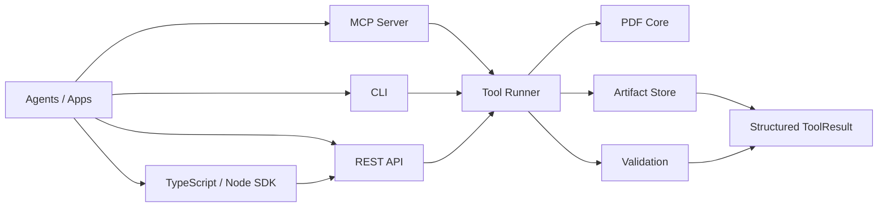

<p align="center">
  
</p>

<h1 align="center">okpdf</h1>

<p align="center">
  Local-first, agent-native PDF infrastructure for CLI, MCP, REST, and self-hosted workflows.
</p>

<p align="center">
  <a href="https://github.com/tover0314-w/okpdf"></a>
  
  
  
  
  
  
</p>

<p align="center">
  <a href="README.md">English</a>
  ·
  <a href="README.zh-CN.md">简体中文</a>
  ·
  <a href="docs/i18n/README.md">Translation guide</a>
</p>

okpdf is building the open-source foundation for agent-native PDF infrastructure: inspect, organize, render, extract, compose, patch, validate, and expose evidence-backed document artifacts through local interfaces that coding agents can call safely.

The public CLI is `okpdf`. The legacy/internal command `agentpdf` still works for compatibility. The TypeScript/Node package lives at `packages/agentpdf-node` and is named `@okpdf/agentpdf-node`.

## Why Star This

- Complete public tool map from day one: 227 public tool names are discoverable now.
- Local-first by default: no hosted URL, paid key, or cloud dependency required.
- Agent-first outputs: every tool returns structured JSON with artifacts, validation, warnings, and next recommended tools.
- Bigger than RAG: the product direction covers context packets, target PDF profiles, source graphs, composition IR, PDF patch transactions, evidence coverage, and multimodal context-to-PDF workflows.
- MCP, REST, and TypeScript ready: Claude Code, Claude Desktop, Cursor, Codex-style agents, Node scripts, and web apps can call the same tool layer.
- Safety-minded PDF workflow: explicit paths, no input mutation, path traversal rejection, metadata removal, and validation for generated PDFs.
- License-safe core: default dependencies avoid GPL/AGPL.

## What Works Today

| Family | Tools | Interfaces |
|---|---|---|
| Inspect | document and page-level facts, including text/image/render evidence | CLI, MCP, REST, Node.js |
| Organize | merge, split, extract/remove/reorder/rotate pages, insert blank pages | CLI, MCP, REST |
| Optimize | content-stream compression, parseable PDF repair/rewrite | CLI, MCP, REST, Node.js |
| Convert | image/Markdown/Text to PDF, render pages to images, extract text and embedded images | CLI, MCP, REST, Node.js |
| Create Agent | local prompt-to-template PDF creation with templates, style packs, context reports, validation, coverage, and optional audit bundles | CLI, MCP, REST, Node.js |
| Context / Compose | context packets, target PDF profiles, source graphs, composition IR, and context-backed PDF creation | CLI, MCP, REST, Node.js |
| Evidence / Patch | context packet reports, coverage reports, and structured append transactions for Markdown, code, tables, images, citations, media references, and slide pages that do not mutate inputs | CLI, MCP, REST, Node.js |
| Edit | text watermark, page numbers | CLI, MCP, REST |
| Metadata | read, update, remove | CLI, MCP, REST |
| Validation | generated PDF validation, render check, blank page check | CLI, MCP, REST |
| AI-lite | local Document IR parse, PDF-to-JSON/Markdown, local RAG ingest/query with citations | CLI, MCP, REST |
| Workflow | local-first agent workflow planning, execution, and reporting with per-step evidence | CLI, MCP, REST, Node.js |
| SDK | TypeScript/Node REST client and Node CLI wrappers | Node.js |
| Discovery | complete tool manifest | CLI, MCP, REST, Node.js |

Planned next local tools include crop/resize, forms, attachments, richer repair diagnostics, better table parsing, visual diff, and redaction verification.

## Languages

- English is the canonical README and documentation language for releases.
- `README.zh-CN.md` is the Simplified Chinese entry point for local developers and agent users.
- Translation rules, ownership, and update expectations live in [docs/i18n/README.md](docs/i18n/README.md).
- New translations should preserve command examples, tool names, JSON fields, and file paths exactly unless the referenced artifact is language-specific.

## Install

```bash
git clone git@github.com:tover0314-w/okpdf.git
cd okpdf
python scripts/setup_dev.py
```

## Quickstart

```bash
python scripts/doctor.py
python scripts/smoke.py
okpdf tools list
okpdf create text "Hello from okpdf" -o .agentpdf-out/hello.pdf --json
```

That is the happy path: install, check the environment, generate a validated PDF.

## Docker

Run the local REST API in a container:

```bash
docker build -t okpdf/local:dev .
docker run --rm -p 7331:7331 -v "$PWD:/workspace" okpdf/local:dev
curl http://127.0.0.1:7331/healthz
```

Or use Compose:

```bash
docker compose up --build
```

The image runs as a non-root user, disables cloud/model calls by default, and exposes the same local REST API that MCP and the TypeScript SDK use.

Common commands:

```bash
okpdf inspect tests/fixtures/simple.pdf --json
okpdf agent setup codex -o .agentpdf-out/codex.mcp.json --safe-root . --json
okpdf inspect-pages tests/fixtures/text.pdf --pages 1 --render-check --json
okpdf workflow plan --goal "Chat with this PDF and cite answers" --input-path .agentpdf-out/numbered.pdf --json
okpdf workflow run examples/workflows/local-rag.json --json
okpdf workflow run .agentpdf-out/plan.json --artifact-dir .agentpdf-out/workflows/chat --binding "<question>=What does this document say?" --binding "<answer>=This document is locally indexed." --json
okpdf workflow report .agentpdf-out/run-result.json -o .agentpdf-out/workflow-report.md --json
okpdf merge tests/fixtures/simple.pdf tests/fixtures/two_pages.pdf -o .agentpdf-out/merged.pdf --json
okpdf reorder-pages .agentpdf-out/merged.pdf --order 3,1,2 -o .agentpdf-out/reordered.pdf --json
okpdf insert-blank-pages .agentpdf-out/reordered.pdf --after-page 1 --count 1 -o .agentpdf-out/with-blank.pdf --json
okpdf compress .agentpdf-out/with-blank.pdf -o .agentpdf-out/with-blank-compressed.pdf --json
okpdf repair .agentpdf-out/with-blank-compressed.pdf -o .agentpdf-out/with-blank-repaired.pdf --json
okpdf image-to-pdf cover.png -o .agentpdf-out/cover.pdf --json
okpdf create markdown examples/sample-documents/business_report.md -o .agentpdf-out/business-report.pdf --style-pack business_report_modern --json
okpdf create templates --json
okpdf create template-packs -o .agentpdf-out/template-packs.json --json
okpdf create validate-template-pack examples/template-packs/local-agent-starter.json -o .agentpdf-out/template-pack.validation.json --json
okpdf create from-template-pack examples/template-packs/local-agent-starter.json --template board_audit --color-scheme executive_blue -o .agentpdf-out/board-audit.pdf --json
okpdf evidence coverage-report .agentpdf-out/board-audit.composition.json -o .agentpdf-out/board-audit.coverage.json --json
okpdf patch plan .agentpdf-out/board-audit.pdf --operations examples/patch-operations/layer-aware-reviewer-note.json -o .agentpdf-out/board-audit.layer.patch.json --composition .agentpdf-out/board-audit.composition.json --layers .agentpdf-out/board-audit.layers.json --reason "Append a layer-aware reviewer note." --json
okpdf patch plan .agentpdf-out/board-audit.pdf --operations examples/patch-operations/regenerate-layer-block.json -o .agentpdf-out/board-audit.regenerate.patch.json --composition .agentpdf-out/board-audit.composition.json --layers .agentpdf-out/board-audit.layers.json --reason "Regenerate a template block with layer evidence." --json
okpdf create preview invoice -o .agentpdf-out/invoice-preview.pdf --json
okpdf create from-prompt "Create a research brief about local PDF agents and template validation." -o .agentpdf-out/research-brief.pdf --template research_brief --style-pack paper_ink --color primary=#4f46e5 --color accent=#f59e0b --json
okpdf create from-prompt "Create an invoice for okpdf local template work." -o .agentpdf-out/invoice.pdf --template invoice --data examples/create-data/invoice.json --json
okpdf context ingest --file src/agentpdf/compose/context.py --role code_evidence --label "Composer Source" -o .agentpdf-out/composer.context-item.json --json
okpdf context code-snapshot src/agentpdf/compose/context.py --line-start 1 --line-end 80 --repository-root . -o .agentpdf-out/composer.snapshot.context-item.json --json
okpdf context data-profile examples/create-data/metrics.csv --label "Runtime Metrics" -o .agentpdf-out/metrics.profile.context-item.json --json
okpdf context packet --item-json .agentpdf-out/composer.context-item.json --text "Create a technical audit PDF from pre-ingested code evidence." -o .agentpdf-out/agent.context.packet.json --title "Agent Packet" --json
okpdf context build --text "Create a technical audit PDF from code, metrics, visual evidence, project docs, and media context." --file src/agentpdf/compose/context.py --file examples/create-data/metrics.csv --file assets/brand/okpdf-logo.png --file examples/sample-documents/business_report.md --item-json examples/context/media-items.json -o .agentpdf-out/context.packet.json --title "Audit Context" --json
okpdf context classify .agentpdf-out/context.packet.json --profile technical_audit -o .agentpdf-out/context.classification.json --json
okpdf evidence context-packet-report .agentpdf-out/context.packet.json -o .agentpdf-out/context-report.pdf --report-output .agentpdf-out/context-report.json --json
okpdf create agent examples/template-packs/local-agent-starter.json --profile technical_audit --context-packet .agentpdf-out/context.packet.json -o .agentpdf-out/board-audit-agent.pdf --plan-output .agentpdf-out/board-audit-agent.plan.json --coverage-output .agentpdf-out/board-audit-agent.coverage.json --context-classification-output .agentpdf-out/board-audit-agent.context-classification.json --context-report-output .agentpdf-out/board-audit-agent.context-report.pdf --context-report-json-output .agentpdf-out/board-audit-agent.context-report.json --bundle-output .agentpdf-out/board-audit-agent.agentpdf-bundle.zip --json
okpdf create from-template-pack examples/template-packs/local-agent-starter.json --template board_audit --color-scheme executive_blue --context-packet .agentpdf-out/context.packet.json -o .agentpdf-out/board-audit-from-context.pdf --json
okpdf target profiles -o .agentpdf-out/target-profiles.json --json
okpdf target validate --profile-json examples/target-profiles/media-learning-deck.json -o .agentpdf-out/media-learning-deck.validation.json --json
okpdf compose plan .agentpdf-out/context.packet.json --profile technical_audit -o .agentpdf-out/technical-audit.plan.json --json
okpdf compose render-ir .agentpdf-out/technical-audit.plan.json -o .agentpdf-out/technical-audit-from-ir.pdf --json
okpdf compose from-context .agentpdf-out/context.packet.json --profile technical_audit -o .agentpdf-out/technical-audit.pdf --json
okpdf compose from-context .agentpdf-out/context.packet.json --profile slide_deck -o .agentpdf-out/agent-review-deck.pdf --json
okpdf compose from-context .agentpdf-out/context.packet.json --profile-json examples/target-profiles/media-learning-deck.json -o .agentpdf-out/media-learning-deck.pdf --json
okpdf compose add-code-block .agentpdf-out/technical-audit.pdf --title "Risk Function" --code "def risky_total(items): return sum(items)" --language python --source-ref ctx_002 --target-slot code_review -o .agentpdf-out/technical-audit.code.pdf --json
okpdf compose add-table .agentpdf-out/technical-audit.pdf --title "Runtime Metrics" --columns metric,value --row latency_ms,42 --source-ref ctx_003 --target-slot evidence_table -o .agentpdf-out/technical-audit.table.pdf --json
okpdf compose add-figure .agentpdf-out/technical-audit.pdf --title "Architecture Figure" --image assets/brand/okpdf-logo.png --caption "Local visual evidence." --source-ref ctx_004 -o .agentpdf-out/technical-audit.figure.pdf --json
okpdf compose add-appendix .agentpdf-out/technical-audit.pdf --title "Source Appendix" --markdown "## Sources\n\n- ctx_002\n- ctx_003\n- ctx_004" --source-ref ctx_002 --source-ref ctx_003 -o .agentpdf-out/technical-audit.appendix.pdf --json
okpdf compose add-citation .agentpdf-out/technical-audit.pdf --title "Source Citation" --source https://example.com/research --quote "Cited claim" --source-ref ctx_web -o .agentpdf-out/technical-audit.citation.pdf --json
okpdf compose add-media-reference .agentpdf-out/technical-audit.pdf --title "Meeting Audio" --media meeting.mp3 --media-kind audio --transcript-excerpt "00:00 Kickoff" --source-ref ctx_audio -o .agentpdf-out/technical-audit.media.pdf --json
okpdf compose add-slide .agentpdf-out/technical-audit.pdf --title "Review Slide" --body "Decision evidence" --source-ref ctx_slide -o .agentpdf-out/technical-audit.slide.pdf --json
okpdf evidence coverage-report .agentpdf-out/technical-audit.composition.json -o .agentpdf-out/technical-audit.coverage.json --json
okpdf patch plan .agentpdf-out/technical-audit.pdf --operations examples/patch-operations/reviewer-note.json -o .agentpdf-out/technical-audit.patch.json --composition .agentpdf-out/technical-audit.composition.json --reason "Add reviewer note appendix." --json
okpdf patch preview .agentpdf-out/technical-audit.patch.json -o .agentpdf-out/technical-audit.patch-preview.json --json
okpdf patch apply .agentpdf-out/technical-audit.patch.json -o .agentpdf-out/technical-audit-patched.pdf --json
okpdf patch verify .agentpdf-out/technical-audit.patch.json .agentpdf-out/technical-audit-patched.pdf --json
okpdf patch plan .agentpdf-out/technical-audit.pdf --operations examples/patch-operations/structured-appendix.json -o .agentpdf-out/technical-audit.structured.patch.json --composition .agentpdf-out/technical-audit.composition.json --reason "Append code, table, image, citation, media, and slide evidence." --json
okpdf watermark .agentpdf-out/cover.pdf --text "CONFIDENTIAL" -o .agentpdf-out/watermarked.pdf --json
okpdf page-numbers .agentpdf-out/watermarked.pdf --template "Page {page} of {total}" -o .agentpdf-out/numbered.pdf --json
okpdf render tests/fixtures/simple.pdf --pages 1 --format png --out-dir .agentpdf-out/renders --json
okpdf extract-images .agentpdf-out/numbered.pdf --pages all --out-dir .agentpdf-out/extracted-images --json
okpdf extract-text tests/fixtures/text.pdf --pages 1 --json
okpdf metadata remove tests/fixtures/metadata.pdf -o .agentpdf-out/metadata-clean.pdf --json
okpdf validate .agentpdf-out/numbered.pdf --expected-pages 1 --json
okpdf render-check .agentpdf-out/numbered.pdf --pages 1 --json
okpdf blank-page-check .agentpdf-out/with-blank.pdf --pages all --json
okpdf parse-lite .agentpdf-out/numbered.pdf --json
okpdf pdf-to-json .agentpdf-out/numbered.pdf -o .agentpdf-out/numbered.ir.json --json
okpdf pdf-to-markdown .agentpdf-out/numbered.pdf -o .agentpdf-out/numbered.md --json
okpdf rag ingest .agentpdf-out/numbered.pdf --index .agentpdf-out/numbered.index.json --json
okpdf rag chat .agentpdf-out/numbered.pdf --question "What does this document say?" --report-output .agentpdf-out/numbered-chat-report.pdf --highlight-output .agentpdf-out/numbered-chat-highlighted.pdf --json
okpdf rag query .agentpdf-out/numbered.index.json --query "What does this document say?" --json
okpdf rag search .agentpdf-out/numbered.index.json --query "document" --json
okpdf rag cite-answer .agentpdf-out/numbered.index.json --answer "This document is locally indexed." --json
okpdf rag highlight-sources .agentpdf-out/numbered.index.json --answer "This document is locally indexed." -o .agentpdf-out/numbered-highlighted.pdf --json
okpdf rag export-report .agentpdf-out/numbered.index.json --question "What does this document say?" --answer "This document is locally indexed." -o .agentpdf-out/numbered-rag-report.pdf --json
```

Template-pack creation writes a validated PDF plus sibling `.composition.json` and `.layers.json` artifacts. The composition file carries source maps, slot routing, and evidence coverage; the layer manifest gives agents stable block/layer ids, target slots, source refs, estimated normalized-page anchors, and edit policies for PDF patch/edit workflows. `pdf.context.ingest` normalizes one local source into a reusable context item, `pdf.context.packet` merges raw or pre-ingested items into a Context Packet so multiple agents can collect evidence independently before composition, and `pdf.context.classify` gives deterministic local block/slot routing hints plus safety limitations before agents compose. `pdf.context.code_snapshot` creates range-aware static code context with symbols, hashes, optional dependency hints, and repository-relative path evidence; it does not execute code. `pdf.context.data_profile` profiles CSV/TSV/JSON/JSONL/XLSX files into table previews with column types and `data_profile_evidence`; XLSX support reads worksheet XML locally and does not evaluate formulas, macros, or legacy `.xls` binary content. Document context includes local Markdown/text/HTML previews and DOCX paragraph text extracted from `word/document.xml` with `document_evidence`; it does not claim full Office layout conversion. `pdf.compose.plan` creates replayable Composition IR plus source map, coverage, validation plan, and a render plan without writing a PDF; `pdf.compose.render_ir` renders that plan into a validated PDF artifact. `pdf.evidence.map_sources` normalizes block/claim source refs against a Context Packet and writes a source-map report with matched/unmatched refs, coverage ratios, and evidence summaries for patch/audit workflows. When `pdf.ai.create.agent` receives a Context Packet it runs classification automatically, records the nested `context_classification` ToolResult in `usage.create_agent_run`, and includes the classification JSON in audit bundles. `pdf.compose.add_code_block`, `pdf.compose.add_table`, `pdf.compose.add_figure`, `pdf.compose.add_appendix`, `pdf.compose.add_citation`, `pdf.compose.add_media_reference`, and `pdf.compose.add_slide` provide one-step append-only composition for agents: each writes a new PDF plus `.compose-block.json`, patch evidence, rollback metadata, and validation. Citation append uses local citation metadata and does not fetch web links by default; media-reference append records local file metadata, MIME type, size, SHA-256, and provided transcript excerpts without transcribing audio/video by default. `pdf.patch.plan` can consume those layers for lower-level append-only notes and `regenerate_block` operations, which create a new PDF artifact with an audited regenerated block appendix instead of claiming unsafe in-place layout-preserving edits.

## TypeScript / Node.js

Run the Python REST server, then call it from TypeScript or Node:

```bash
okpdf serve --api
node packages/agentpdf-node/dist/src/cli.js tools
node packages/agentpdf-node/dist/src/cli.js create-text --text "Hello Node" -o .agentpdf-out/node.pdf
```

SDK usage:

```ts
import { AgentPDFClient } from "@okpdf/agentpdf-node";

const client = new AgentPDFClient({ baseUrl: "http://127.0.0.1:7331" });
const result = await client.createMarkdownPdf({
  markdown: "# Agent Report\n\n- Local first\n- TypeScript ready",
  outputPath: ".agentpdf-out/report.pdf",
  stylePack: "business_report_modern",
});
const brief = await client.createFromPrompt({
  prompt: "Create a proposal about local PDF template agents.",
  outputPath: ".agentpdf-out/proposal.pdf",
  template: "proposal",
  stylePack: "business_report_modern",
  colors: { primary: "#4f46e5", accent: "#f59e0b" },
});
const pageFacts = await client.inspectPages({
  inputPath: ".agentpdf-out/report.pdf",
  pages: "1",
  renderCheck: true,
});

await client.watermark({
  inputPath: ".agentpdf-out/report.pdf",
  text: "DRAFT",
  outputPath: ".agentpdf-out/report-draft.pdf",
});

console.log(pageFacts.usage.pages);
console.log(result.artifacts[0]?.path);
console.log(brief.usage.template_id, brief.validation?.status);
```

## Agent Interfaces

### MCP

Run a local stdio MCP server:

```bash
okpdf serve --mcp --safe-root .
```

Generate a Claude Code project config:

```bash
okpdf agent setup claude-code -o .mcp.json --json
```

Example config:

```json
{
  "mcpServers": {
    "agentpdf": {
      "type": "stdio",
      "command": "okpdf",
      "args": ["serve", "--mcp", "--safe-root", "${CLAUDE_PROJECT_DIR:-.}"]
    }
  }
}
```

MCP tools currently exposed:

- `agent_setup_claude_code`
- `agentpdf_tool_manifest`
- `pdf_inspect_document`
- `pdf_inspect_pages`
- `pdf_workflow_plan`
- `pdf_workflow_run`
- `pdf_workflow_report`
- `pdf_merge`
- `pdf_split`
- `pdf_extract_pages`
- `pdf_remove_pages`
- `pdf_rotate_pages`
- `pdf_reorder_pages`
- `pdf_insert_blank_pages`
- `pdf_optimize_compress`
- `pdf_optimize_repair`
- `pdf_image_to_pdf`
- `pdf_watermark`
- `pdf_add_page_numbers`
- `pdf_create_text`
- `pdf_create_markdown`
- `pdf_ai_create_from_prompt`
- `pdf_ai_create_templates`
- `pdf_ai_create_template_packs`
- `pdf_ai_create_validate_template_pack`
- `pdf_ai_create_from_template_pack`
- `pdf_ai_create_template_preview`
- `pdf_render_pages`
- `pdf_extract_images`
- `pdf_extract_text`
- `pdf_pdf_to_json`
- `pdf_pdf_to_markdown`
- `pdf_metadata_read`
- `pdf_metadata_update`
- `pdf_metadata_remove`
- `pdf_validate_output`
- `pdf_render_check`
- `pdf_blank_page_check`
- `pdf_ai_parse_lite`
- `pdf_ai_rag_ingest`
- `pdf_ai_rag_chat`
- `pdf_ai_rag_cite_answer`
- `pdf_ai_rag_export_report`
- `pdf_ai_rag_highlight_sources`
- `pdf_ai_rag_query`
- `pdf_ai_rag_search`

### REST

Run the local HTTP API:

```bash
okpdf serve --api
```

Useful endpoints:

```text
GET  /healthz
GET  /v1/tools
GET  /v1/tools/{tool_name}
POST /v1/tools/{tool_name}/run
GET  /v1/jobs/{job_id}
GET  /v1/artifacts/{artifact_id}
GET  /v1/artifacts/{artifact_id}/download
```

Example:

```bash
curl -X POST http://127.0.0.1:7331/v1/tools/pdf.inspect.document/run \
  -H 'Content-Type: application/json' \
  -d '{"path": "tests/fixtures/simple.pdf"}'
```

Inspect page facts with render evidence:

```bash
curl -X POST http://127.0.0.1:7331/v1/tools/pdf.inspect.pages/run \
  -H 'Content-Type: application/json' \
  -d '{"input_path": "tests/fixtures/text.pdf", "pages": "1", "render_check": true}'
```

Extract embedded images:

```bash
curl -X POST http://127.0.0.1:7331/v1/tools/pdf.convert.extract_images/run \
  -H 'Content-Type: application/json' \
  -d '{"input_path": ".agentpdf-out/report.pdf", "pages": "all", "out_dir": ".agentpdf-out/extracted-images"}'
```

Plan an agent workflow:

```bash
curl -X POST http://127.0.0.1:7331/v1/tools/pdf.workflow.plan/run \
  -H 'Content-Type: application/json' \
  -d '{"goal": "Chat with this PDF and cite answers", "input_path": ".agentpdf-out/report.pdf"}'
```

Run a local workflow manifest:

```bash
curl -X POST http://127.0.0.1:7331/v1/tools/pdf.workflow.run/run \
  -H 'Content-Type: application/json' \
  -d '{"workflow":{"steps":[{"step_id":"inspect","tool":"pdf.inspect.document","input":{"path":".agentpdf-out/report.pdf"}}]}}'
```

`pdf.workflow.run` can also consume the full JSON returned by `pdf.workflow.plan`; pass runtime values under `bindings` for placeholders such as `<question>` and `<answer>`, and set `artifact_dir` when the runner should auto-create paths like `<output.index.json>`.

Create a PDF from Markdown:

```bash
curl -X POST http://127.0.0.1:7331/v1/tools/pdf.convert.markdown_to_pdf/run \
  -H 'Content-Type: application/json' \
  -d '{"markdown": "# Agent Report\n\n- Local first\n- MCP ready", "output_path": ".agentpdf-out/report.pdf"}'
```

Compress a PDF:

```bash
curl -X POST http://127.0.0.1:7331/v1/tools/pdf.optimize.compress/run \
  -H 'Content-Type: application/json' \
  -d '{"input_path": ".agentpdf-out/report.pdf", "output_path": ".agentpdf-out/report-compressed.pdf"}'
```

## Tool Result Contract

Every public tool returns the same shape:

```json
{
  "job_id": "job_...",
  "status": "succeeded",
  "tool": "pdf.organize.merge",
  "artifacts": [],
  "validation": {},
  "warnings": [],
  "usage": {},
  "next_recommended_tools": []
}
```

Generated PDFs include artifact metadata and validation checks such as parseability and page count.

## Architecture



Core code lives under `src/agentpdf`:

- `core/`: deterministic PDF operations.
- `tools/`: registry and runner wrappers.
- `schemas/`: Pydantic public contracts.
- `artifacts/`: local artifact metadata.
- `validation/`: generated output validation.
- `cli/`: Typer CLI.
- `mcp/`: FastMCP server.
- `api/`: FastAPI local REST server.
- `security/`: path safety helpers.

## Open-Source Direction

okpdf is inspired by mature open-source document processing projects such as pdf-craft, Docling, Marker, Unstructured, and local-first PDF tooling. The project borrows architectural ideas, not implementation code:

- local/offline document processing;
- handler boundaries for reading, rendering, extraction, OCR, and output writing;
- optional heavyweight workers with explicit dependency and cache locations;
- per-page warnings and partial-failure reporting;
- cloud/model functionality as an explicit layer above the local core.

## Roadmap

- Lite document parse and local RAG demo.
- More creation inputs and style packs.
- More deterministic operations: cropping, forms baseline, metadata page info, attachments, and safe redaction helpers.
- Richer validation: repair diagnostics, page visual diff, redaction verification.
- Context packet, target PDF profile, source graph, composition IR, artifact lineage, and patch manifests.
- Multimodal context-to-PDF workflows for images, video, documents, code, links, data, and existing PDFs.
- Docker and self-hosted examples.
- Cloud worker boundary for advanced OCR, agentic parse, multimodal processing, and hosted batch jobs.

## Development

```bash
python scripts/setup_dev.py
pytest -q
npm test --workspace @okpdf/agentpdf-node
ruff check src tests scripts
```

This workspace currently has no required cloud service for local development.

## Repository Hygiene

Commit source code, schemas, tests, small generated fixtures, examples with clear provenance, and docs. Do not commit local outputs, dependency folders, caches, secrets, personal MCP configs, build artifacts, logs, databases, or ad hoc generated PDFs. The full policy lives in [docs/REPOSITORY_HYGIENE.md](docs/REPOSITORY_HYGIENE.md).

Generated PDFs are usually written under `.agentpdf-out/`, which is ignored. The only generated PDFs that should be committed are tiny, license-safe, reproducible examples with a README explaining the regeneration command, such as `examples/generated/hello.pdf`.

Before pushing:

```bash
git status --short
python scripts/doctor.py
pytest -q
npm --workspace @okpdf/agentpdf-node test
```

## Troubleshooting

- `pytest -q` should use pytest's runtime temp directory. If a local `.pytest-tmp` folder is locked by another Windows process, it is safe to close that process or delete the folder after confirming no test run is active.
- If render-related commands fail, run `python scripts/doctor.py` first and confirm `pypdfium2` is installed in the active Python environment.
- If Node SDK tests fail before reaching the API client tests, run `npm install` at the repository root and then `npm --workspace @okpdf/agentpdf-node test`.
- If the REST API port is busy, start it on another port with `okpdf serve --api --port 7332`.

## Reference Projects

The project intentionally studies mature PDF/document tooling such as [pypdf](https://github.com/py-pdf/pypdf), [qpdf](https://github.com/qpdf/qpdf), [pdfcpu](https://github.com/pdfcpu/pdfcpu), [pdfplumber](https://github.com/jsvine/pdfplumber), [OCRmyPDF](https://ocrmypdf.readthedocs.io/), [Docling](https://github.com/docling-project/docling), [Marker](https://github.com/VikParuchuri/marker), and [Stirling-PDF](https://github.com/Stirling-Tools/Stirling-PDF). The synthesis lives in [docs/33_REFERENCE_PROJECT_SYNTHESIS.md](docs/33_REFERENCE_PROJECT_SYNTHESIS.md).

The larger agent-native multimodal PRD lives in [docs/35_AGENT_NATIVE_MULTIMODAL_PDF_INFRA_PRD.md](docs/35_AGENT_NATIVE_MULTIMODAL_PDF_INFRA_PRD.md). The agent-infra and cloud strategy lives in [docs/34_AGENT_INFRA_AI_CLOUD_STRATEGY.md](docs/34_AGENT_INFRA_AI_CLOUD_STRATEGY.md).

## License

Apache-2.0. See [LICENSE](LICENSE).
