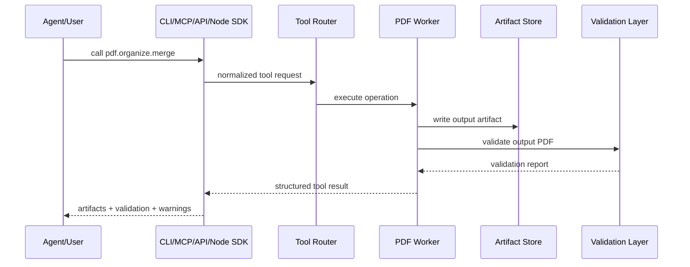
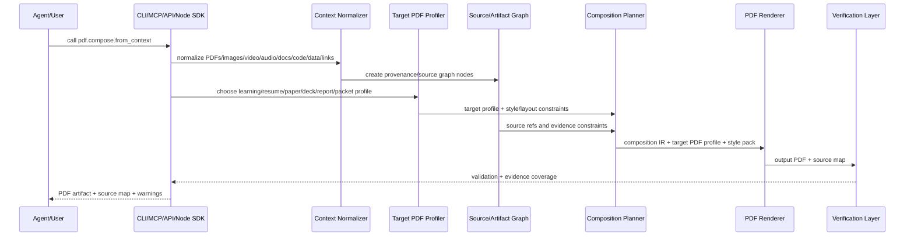
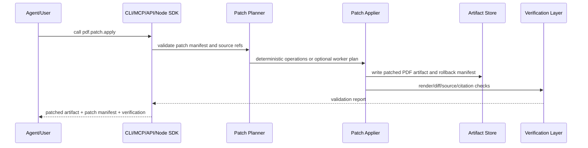

# 03 - Architecture

## Architectural goal

AgentPDF Infra should be a local-first, agent-native PDF operating layer that can be invoked by agents, developers, web apps, and workflow systems.

The architecture should support both current deterministic PDF tools and the longer-term platform loop:

```text
context packet + target PDF profile -> understanding -> composition plan -> render/patch -> verify -> evidence-backed PDF artifact
```

## Core components

```text
agentpdf/
  tool registry
  schemas
  artifact model
  artifact graph
  context packet model
  target PDF profile model
  source graph
  job model
  validation model
  PDF core operations
  document IR
  composition IR
  patch transaction model
  workflow engine
  evidence/citation layer
  MCP server
  REST API
  CLI
  TypeScript/Node SDK
  local RAG/evidence demo
```

## Request lifecycle - deterministic PDF operation



## Request lifecycle - context to target PDF artifact



## Request lifecycle - PDF patch transaction



## Tool router

The tool router should:

- Map stable names to implementations.
- Validate input with Pydantic.
- Enforce file safety.
- Generate job IDs.
- Track artifacts.
- Track context packet IDs and target PDF profiles when tools compose new artifacts.
- Track source graph deltas when tools ingest or derive source material.
- Track patch manifests when tools mutate or regenerate document artifacts.
- Return a uniform result object.
- Provide tool discovery.

## TypeScript / Node SDK

The Node package is a typed REST client, not a second PDF engine. JavaScript agents and web apps call the local REST API and receive the same `ToolResult` JSON as CLI and MCP clients.

This keeps PDF behavior centralized in the Python core while making okpdf natural to use from Node.js, Vercel, LangChain.js, AI SDK tools, and other TypeScript-heavy ecosystems.

## Artifact store

For local open-source mode, artifact store may be a local directory.

For future hosted mode, artifact store may become object storage.

Artifact manifest should include:

- Artifact ID.
- MIME type.
- File size.
- SHA-256.
- Page count where applicable.
- Creation time.
- Source tool.
- Source graph refs.
- Parent artifact refs.
- Patch manifest ref when applicable.
- Retention hint.
- Validation report link.

## Context packet and target PDF profile

Context is the first-class input to agent-native composition. A context packet may contain PDFs, images, screenshots, scans, video, audio, web links, Markdown, HTML, Office-like documents, text, code, spreadsheets, CSV/JSON, database results, prompts, and review notes.

The local document baseline extracts text previews from Markdown, HTML, text, and DOCX files. DOCX support reads paragraph text from `word/document.xml` and records `document_evidence`; it does not claim full Office layout conversion.

Dedicated local context tools add stronger evidence for code and data inputs: `pdf.context.code_snapshot` records selected line ranges, code hashes, symbols, and repository-relative paths without executing code, while `pdf.context.data_profile` records CSV/TSV/JSON/JSONL/XLSX table previews, column types, hashes, and sheet metadata without evaluating formulas or macros.

The target PDF profile is the first-class output intent. It defines the PDF genre, audience, structure, style, validation requirements, and expected blocks before rendering begins.

Target profiles include:

- Learning PDF.
- Resume PDF.
- Academic paper PDF.
- PPT/deck-like PDF.
- Business report PDF.
- Evidence packet PDF.
- Legal review packet PDF.
- Training handout PDF.
- Worksheet PDF.
- Code audit PDF.
- Invoice or formal document PDF.

## Source graph

The source graph is derived from context packets and records where document content came from.

Source nodes may represent:

- PDF pages and blocks.
- Image files and detected regions.
- Video transcripts and keyframes.
- Audio transcript segments.
- Web captures.
- Markdown/HTML/text files.
- Code files and line ranges.
- Spreadsheet ranges, CSV rows, database query results, or JSON fields.
- Human prompts and reviewer notes.

Generated PDF blocks should include source refs when evidence exists.

## Document IR and composition IR

Document IR describes parsed context items. Composition IR describes the target PDF artifact that should be rendered.

Document IR should preserve page geometry, reading order, bboxes, tables, figures, forms, annotations, links, and confidence.

Composition IR should support target PDF profiles such as learning PDFs, resumes, papers, reports, packets, appendices, and slide-like PDFs with rich blocks:

- Sections.
- Slides.
- Paragraphs.
- Tables.
- Charts.
- Figures.
- Images.
- Code blocks.
- Callouts.
- Citations.
- Speaker notes.
- Appendices.

## Patch transaction model

Agent edits should be represented as explicit patch transactions whenever possible.
The current local implementation is intentionally append-only: agents can add audited Markdown, code, table, image, citation, media-reference, and slide evidence pages to a new output PDF, then verify the page-count delta and input artifact hash.

A patch transaction should include:

- Input artifact.
- Ordered operations.
- Targets by page, bbox, block id, section id, or source ref.
- New blocks or overlays.
- Validation requirements.
- Rollback strategy.
- Warnings for operations that are approximate or require regeneration.

## Sync vs async jobs

Open-source local mode can start mostly synchronous, but the data model should support async jobs for cloud and long-running tasks.

Recommended:

- Synchronous for small deterministic local CLI operations.
- Async-compatible result model for OCR, parse, convert, AI, composition, patching, video/audio processing, and batch.

## Worker categories

- `core`: deterministic PDF page/file operations.
- `convert`: conversions to/from PDF.
- `render`: page rendering and thumbnails.
- `context`: context normalization for PDF, image, video, audio, web links, documents, code, and data.
- `target`: target PDF profile selection and validation.
- `ir`: parsing and document structure.
- `compose`: composition IR and PDF artifact generation.
- `patch`: structured edit planning, preview, apply, verify, and rollback.
- `evidence`: source refs, citations, coverage, and source highlighting.
- `ocr`: OCR and scan cleanup.
- `rag`: chunking, retrieval, citations as a subset of evidence.
- `create`: PDF generation and style packs.
- `edit`: annotation, overlays, forms, redaction.
- `present`: slide-like PDF generation and speaker notes.
- `security`: encrypt, decrypt, sanitize, verify.
- `validation`: renderability, diff, blank pages, redaction checks, source coverage, layout checks.
- `workflow`: planning, running, reporting, batch, retries, and audit trails.

## Failure model

All errors should have stable machine-readable codes:

- `file_not_found`
- `unsupported_file_type`
- `encrypted_pdf_requires_password`
- `invalid_page_range`
- `pdf_parse_failed`
- `pdf_render_failed`
- `output_validation_failed`
- `dependency_missing`
- `tool_not_implemented`
- `unsafe_input_rejected`
- `quota_required_for_cloud_feature`
- `source_ref_not_found`
- `source_coverage_failed`
- `patch_target_not_found`
- `patch_validation_failed`
- `layout_overflow_detected`
- `context_item_unsupported`
- `target_profile_invalid`

## Agent-specific requirements

Agent outputs should include:

- Next recommended tools.
- Warnings.
- Confidence levels.
- Context packet metadata where applicable.
- Target PDF profile where applicable.
- Page/bbox/timestamp/file/row citations where applicable.
- Source graph deltas where applicable.
- Patch manifests where applicable.
- Rendered preview references.
- Deterministic validation.
- Evidence coverage.
- Retry hints when a tool fails.
