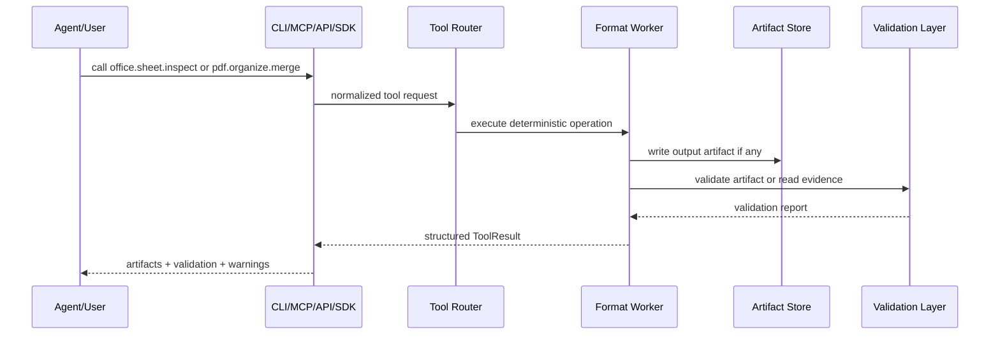
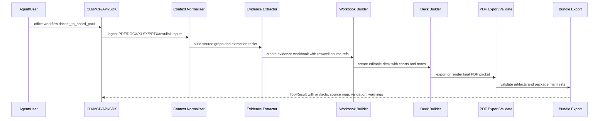
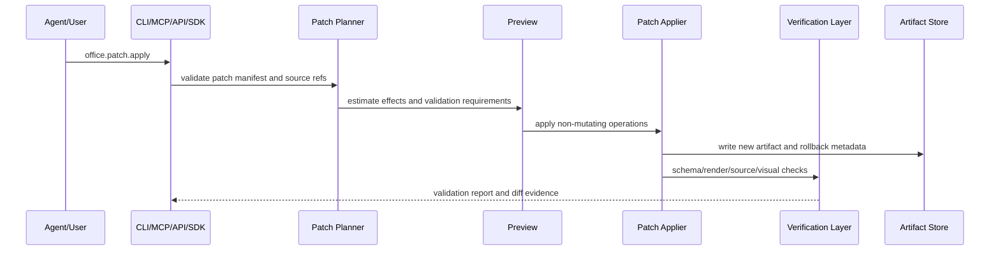

# 03 - Architecture

## Architectural Goal

okoffice should be a local-first, agent-native Office operating layer that can be invoked by agents, developers, web apps, and workflow systems.

The architecture supports both current deterministic PDF tools and the longer-term platform loop:

```text
context packet + target artifact profile -> extract/model -> composition plan -> render/patch -> verify -> bundle/report
```

## Core Components

```text
okoffice/
  tool registry
  schemas
  artifact model
  artifact graph
  context packet model
  target artifact profile model
  source graph
  job model
  validation model
  PDF domain
  Word domain
  Sheet domain
  Deck domain
  Office IR
  composition IR
  patch transaction model
  workflow engine
  evidence/citation layer
  MCP server
  REST API
  CLI
  TypeScript/Node SDK
  local RAG/evidence demo
  optional worker adapters
```

## Domain Boundary

The current codebase implements the PDF domain first. Future okoffice domains should not reimplement the same scaffolding.

Shared layers:

- Tool routing.
- `ToolResult`.
- Artifact manifests.
- Validation reports.
- Path safety.
- Context packets.
- Source graphs.
- Workflow planning/running/reporting.
- MCP/REST/CLI/SDK interfaces.

Format domains:

- `pdf`: page geometry, renderability, redaction, metadata, page operations, immutable delivery.
- `word`: paragraphs, runs, styles, sections, tables, fields, comments, revisions, headers/footers.
- `sheet`: cells, ranges, formulas, tables, pivots, charts, named ranges, dashboards, print settings.
- `deck`: slides, shapes, tables, charts, images, notes, layouts, themes, animations, media.

## Request Lifecycle - Deterministic Format Operation



## Request Lifecycle - Cross-document Board Pack



## Request Lifecycle - Patch Transaction



## Tool Router

The tool router should:

- Map stable names to implementations.
- Preserve current `pdf.*` compatibility.
- Support target `office.*` aliases and future names.
- Validate input with Pydantic.
- Enforce file safety.
- Generate job IDs.
- Track artifacts.
- Track context packet IDs and target profiles when tools compose new artifacts.
- Track source graph deltas when tools ingest or derive source material.
- Track patch manifests when tools mutate or regenerate artifacts.
- Return a uniform result object.
- Provide tool discovery.

## Worker Model

Workers are adapters behind the same tool contract.

Recommended worker categories:

- `core`: shared path, artifact, validation, and routing logic.
- `pdf`: deterministic PDF operations.
- `word`: DOCX inspect/create/edit/validate.
- `sheet`: XLSX inspect/create/edit/validate.
- `deck`: PPTX inspect/create/edit/validate.
- `convert`: conversions across PDF, Office, HTML, Markdown, images, and text.
- `render`: page/slide/sheet/document previews.
- `context`: heterogeneous context normalization.
- `extract`: schema extraction, table extraction, and source-backed data extraction.
- `target`: target artifact profile selection and validation.
- `ir`: parsing and Office IR.
- `compose`: composition IR and artifact generation.
- `patch`: structured edit planning, preview, apply, verify, and rollback.
- `evidence`: source refs, citations, coverage, and source highlighting.
- `ocr`: OCR and scan cleanup.
- `rag`: chunking, retrieval, citations as a subset of evidence.
- `security`: sanitize, redact, metadata removal, embedded-object and macro risk detection.
- `workflow`: planning, running, reporting, batch, retries, and audit trails.

Optional worker adapters may include OfficeCLI, LibreOffice, browser renderers, OCR engines, and model workers. Each adapter must expose capability evidence and structured unavailable-worker errors.

## Artifact Store

For local open-source mode, artifact storage may be a local directory.

For hosted mode, artifact storage may become object storage.

Artifact manifests should include:

- Artifact ID.
- Artifact kind: `pdf`, `docx`, `xlsx`, `pptx`, `html`, `image`, `json`, `bundle`.
- MIME type.
- File size.
- SHA-256.
- Page/slide/sheet count where applicable.
- Creation time.
- Source tool.
- Source graph refs.
- Parent artifact refs.
- Patch manifest ref when applicable.
- Preview/render refs.
- Validation report link.
- Retention hint.

## Context Packet And Target Artifact Profile

Context is the first-class input to agent-native composition. A context packet may contain PDFs, Word docs, Excel workbooks, PowerPoint decks, images, screenshots, scans, video, audio, web links, Markdown, HTML, text, code, CSV/JSON, database results, prompts, and review notes.

A target artifact profile defines the intended output type, audience, structure, style, validation requirements, and accepted source types.

Target profiles include:

- `word_report`
- `word_memo`
- `excel_model`
- `evidence_workbook`
- `powerpoint_deck`
- `board_deck`
- `pdf_packet`
- `audit_bundle`
- `training_handout`
- `research_brief`
- `legal_review_packet`
- `invoice_or_formal_document`

## Source Graph

The source graph records where document content came from.

Source nodes may represent:

- PDF pages and blocks.
- Word paragraphs, runs, tables, cells, comments, revisions, fields, headers, and footers.
- Excel sheets, cells, ranges, formulas, tables, pivots, charts, comments, and named ranges.
- PowerPoint slides, shapes, tables, charts, images, notes, comments, and media.
- Image files and detected regions.
- Video transcripts and keyframes.
- Audio transcript segments.
- Web captures.
- Markdown/HTML/text files.
- Code files and line ranges.
- CSV rows, database query results, or JSON fields.
- Human prompts and reviewer notes.

Generated output blocks, cells, charts, slides, and report sections should include source refs when evidence exists.

## Office IR And Composition IR

Office IR describes parsed context items and existing artifacts. It should preserve:

- Semantic structure.
- Visual geometry when known.
- Reading order.
- Tables and formulas.
- Charts and figures.
- Comments and revisions.
- Links and metadata.
- Confidence.
- Source locators.

Composition IR describes the target artifact that should be rendered. It should support:

- Word sections, paragraphs, tables, callouts, citations, comments, and fields.
- Excel sheets, tables, formulas, assumptions, checks, pivots, charts, and dashboards.
- PowerPoint slides, shapes, charts, diagrams, notes, and sections.
- PDF pages, appendices, evidence packets, and validation reports.
- Bundles containing multiple artifacts and manifests.

## Validation Layer

Validation is format-aware and evidence-aware.

Common checks:

- Artifact exists.
- Checksum recorded.
- Input was not mutated.
- Placeholder leakage.
- Metadata and embedded-object safety warnings.
- Source coverage.
- Manifest completeness.

Format-specific checks:

- PDF: page count, renderability, blank pages, text layer, redaction verification, visual diff.
- Word: schema, outline, field presence, table overflow, comments/revisions, preview.
- Excel: formula errors, cached values, `###`, chart anchors, named ranges, pivots, source notes.
- PowerPoint: slide order, shape bounds, text overflow, contrast, notes, screenshot/contact-sheet preview.

## Failure Model

All errors should have stable machine-readable codes. Existing PDF codes remain valid. Add Office-aware codes over time:

- `file_not_found`
- `unsupported_file_type`
- `invalid_page_range`
- `invalid_sheet_range`
- `invalid_slide_range`
- `document_parse_failed`
- `office_schema_validation_failed`
- `pdf_render_failed`
- `office_render_failed`
- `formula_validation_failed`
- `placeholder_leak_detected`
- `layout_overflow_detected`
- `embedded_object_risk`
- `macro_execution_blocked`
- `dependency_missing`
- `tool_not_implemented`
- `worker_unavailable`
- `unsafe_input_rejected`
- `quota_required_for_cloud_feature`
- `source_ref_not_found`
- `source_coverage_failed`
- `patch_target_not_found`
- `patch_validation_failed`

## TypeScript / Node SDK

The Node package should be a typed REST client, not a second Office engine. JavaScript agents and web apps call the local REST API and receive the same `ToolResult` JSON as CLI and MCP clients.

This keeps behavior centralized while making okoffice natural to use from Node.js, Vercel, LangChain.js, AI SDK tools, and TypeScript-heavy ecosystems.

## Sync vs Async Jobs

Open-source local mode can start mostly synchronous, but the data model should support async jobs for cloud and long-running tasks.

Recommended:

- Synchronous for small deterministic local CLI operations.
- Async-compatible result model for OCR, parse, convert, AI, composition, patching, video/audio processing, batch, rendering, and large Office workflows.
