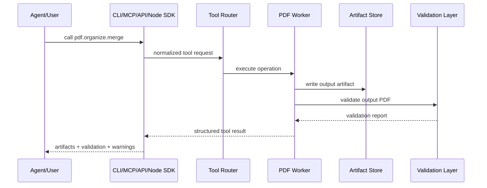

# 03 — Architecture

## Architectural goal

AgentPDF Infra should be a local-first PDF operating layer that can be invoked by agents, developers, and web apps.

## Core components

```text
agentpdf/
  tool registry
  schemas
  artifact model
  job model
  validation model
  PDF core operations
  document IR
  MCP server
  REST API
  CLI
  TypeScript/Node SDK
  local RAG demo
```

## Request lifecycle



## Tool router

The tool router should:

- Map stable names to implementations.
- Validate input with Pydantic.
- Enforce file safety.
- Generate job IDs.
- Track artifacts.
- Return a uniform result object.
- Provide tool discovery.

## TypeScript / Node SDK

The Node package is a typed REST client, not a second PDF engine. JavaScript agents and web apps call the local REST API and receive the same `ToolResult` JSON as CLI and MCP clients.

This keeps PDF behavior centralized in the Python core while making okpdf natural to use from Node.js, Vercel, LangChain.js, AI SDK tools, and other TypeScript-heavy ecosystems.

## Artifact store

For local open-source mode, artifact store may be a local directory.

For future hosted mode, artifact store may become object storage.

Artifact manifest should include:

- Artifact ID.
- MIME type.
- File size.
- SHA-256.
- Page count where applicable.
- Creation time.
- Source tool.
- Retention hint.
- Validation report link.

## Sync vs async jobs

Open-source local mode can start mostly synchronous, but the data model should support async jobs for cloud and long-running tasks.

Recommended:

- Synchronous for small deterministic local CLI operations.
- Async-compatible result model for OCR, parse, convert, AI, batch.

## Worker categories

- `core`: deterministic PDF page/file operations.
- `convert`: conversions to/from PDF.
- `render`: page rendering and thumbnails.
- `ocr`: OCR and scan cleanup.
- `ir`: parsing and document structure.
- `rag`: chunking, retrieval, citations.
- `create`: PDF generation and style packs.
- `edit`: annotation, overlays, forms, redaction.
- `security`: encrypt, decrypt, sanitize, verify.
- `validation`: renderability, diff, blank pages, redaction checks.

## Failure model

All errors should have stable machine-readable codes:

- `file_not_found`
- `unsupported_file_type`
- `encrypted_pdf_requires_password`
- `invalid_page_range`
- `pdf_parse_failed`
- `pdf_render_failed`
- `output_validation_failed`
- `dependency_missing`
- `tool_not_implemented`
- `unsafe_input_rejected`
- `quota_required_for_cloud_feature`

## Agent-specific requirements

Agent outputs should include:

- Next recommended tools.
- Warnings.
- Confidence levels.
- Page/bbox citations where applicable.
- Rendered preview references.
- Deterministic validation.
- Retry hints when tool fails.
