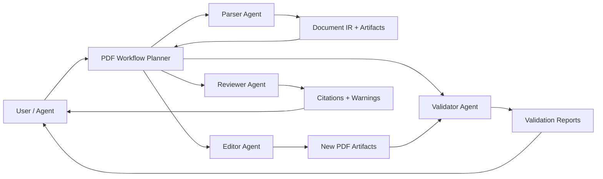

# Agent Infra, AI PDF, and Cloud Strategy

This document captures the product direction for okpdf after the local OSS core. The project is agent infrastructure first: local, open-source, and free by default, with a future hosted cloud service that can monetize expensive AI, OCR, storage, batch, and workflow features.

## Product Thesis

okpdf should become the PDF layer for agents. A coding agent should be able to inspect, transform, validate, understand, cite, create, edit, and route PDFs without inventing one-off scripts for each repository.

The local edition must stay useful without cloud billing. The hosted product can add Firecrawl-style convenience, scale, persistence, API keys, free quotas, and paid plans around resource-heavy work.

## Four Capability Layers

1. Basic PDF tools

- Inspect, merge, split, extract, remove, reorder, rotate, insert blank pages.
- Page-level inspection with geometry, text-layer, image-count, and render evidence.
- Convert image/Text/Markdown to PDF.
- Render pages, extract text and embedded images, read/update/remove metadata.
- Validate parseability, page count, renderability, and blank pages.

2. Advanced PDF tools

- Compress, repair, optimize, crop/resize, n-up/booklet, attachments, forms, annotations, PDF/A, security, redaction verification, visual diff.
- Keep this deterministic layer license-safe and local-first.
- Current local baseline includes content-stream compression and parseable PDF repair/rewrite; deeper repair diagnostics remain a future optional worker.

3. AI PDF tools

- Parse to Document IR with page numbers, bboxes, spans, tables, images, formulas, and layout evidence.
- Chat with PDFs using cited retrieval, not just Markdown summaries.
- Current local baseline includes one-shot PDF chat with answer, citations, cited report PDF, and highlighted source PDF artifacts.
- Understand image-heavy pages, charts, math/LaTeX, tables, handwriting/scans, and mixed-language documents through optional local or cloud workers.
- Create new PDFs from prompts, templates, style packs, colors, themes, and brand constraints.
- Edit existing PDFs through explicit, evidence-backed operations, while avoiding claims of perfect layout-preserving body text edits.

4. Agent PDF tools

- Agent-readable planning tools: inspect -> plan -> execute -> validate -> report.
- Multi-agent roles for complex workflows: parser, verifier, editor, reviewer, redactor, template designer, citation checker.
- Durable workflow manifests for batch operations and audit trails.
- MCP, REST, CLI, TypeScript SDK, and future wrappers for broader agent ecosystems.
- Current local baseline includes `pdf.workflow.plan`, which returns ordered tool steps, agent roles, validation expectations, and explicit cloud-boundary notes.
- Current local baseline also includes `pdf.workflow.run`, which executes supported local tools in order and returns per-step evidence for agents.
- Current local baseline includes `pdf.workflow.report`, which turns workflow runs into structured audit summaries and optional Markdown artifacts.

## Local-First Implementation Priority

Finish local development before cloud expansion:

1. Make Docker, CLI, REST, MCP, and Node SDK easy to run locally.
2. Complete deterministic PDF utility breadth.
3. Improve local Document IR, parse-lite, RAG search/query, and citation evidence.
4. Add optional worker contracts for newer parsers/OCR engines.
5. Add cloud APIs only after the local contract is stable.

## First Agent Ecosystem Targets

1. Claude Code / Claude Desktop through MCP stdio and streamable HTTP.
2. Codex and Cursor through AGENTS.md, CLI, REST, and MCP examples.
3. KiloCode, OpenCode/OpenClaw-style skill ecosystems, OpenAI Agents, LangChain, LlamaIndex, n8n, Zapier, and Make.
4. Hosted API and frontend integrations after local agent workflows are credible.

## Cloud Service Boundary

The OSS core should never require hosted billing. Cloud should provide:

- Free quota for trying agentic parse, OCR, hosted RAG, and template generation.
- Paid tiers for high page volume, model tokens, advanced OCR, batch concurrency, long retention, team/org features, webhooks, and enterprise controls.
- BYOK mode when users want to pay model providers directly.
- Platform-margin mode for managed model routing and hosted convenience.

Paid features should be additive services, not hidden dependencies of local deterministic tools.

## Reference Projects To Study

These projects should guide architecture and product taste, not be copied blindly:

- Firecrawl: OSS plus hosted API positioning for agents.
- pdf-craft: modern OCR/PDF-to-Markdown thinking, including formulas and tables.
- LiteParse: local-first spatial document parsing and AI-ready layout output.
- Docling and Marker: Document IR, Markdown/JSON/chunk export, and parsing pipelines.
- OCRmyPDF: pipeline discipline, skipped-page warnings, sidecar text, and validation.
- pdfplumber/PyMuPDF/PDF.js: page object, bbox, rendering, and viewer mental models.
- KiloCode, Claude Code, OpenAI Agents, and OpenCode/OpenClaw-style tools: agent ecosystem integration patterns.
- Karpathy-style research/wiki projects: source-grounded synthesis, citations, iterative exploration, and user-facing knowledge artifacts.

## AI PDF Roadmap

Implemented local baseline:

- Local Document IR from text-layer PDFs.
- JSON and Markdown export with page/bbox evidence.
- Local RAG ingest/query/search with citations.
- Highlighted source PDFs from local RAG citations.

Near-term local:

- Improve IR segmentation into headings, paragraphs, lists, tables, images, and formulas placeholders.
- Add source-highlighting reports and local Q&A export PDFs.

Optional worker layer:

- OCR worker contract.
- Table/formula parser contract.
- Vision parser contract for scanned/image-heavy PDFs.
- Local model/BYOK/cloud routing config.

Cloud later:

- Agentic parse API.
- PDF chat with persistent hosted indexes.
- Template gallery and SEO-friendly template pages.
- PDF creation from templates, colors, brand kits, and data.
- PDF edit workflows with previews, validation, and rollback manifests.

## Multi-Agent Architecture Sketch

Every agent action must produce structured evidence: artifacts, page numbers, bboxes when available, validation checks, warnings, and next recommended tools.
