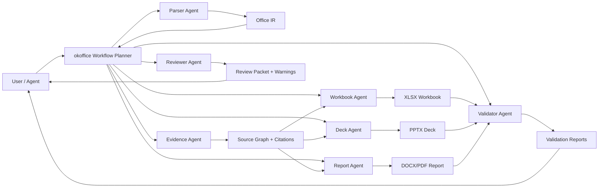

# Agent Infra, okoffice, AI, and Cloud Strategy

This document captures the product direction for okoffice after the local OSS core. The project is agent infrastructure first: local, open-source, and free by default, with a future hosted cloud service that can monetize expensive AI, OCR, Office rendering/conversion, multimodal context processing, storage, batch, verification, and workflow features.

## Product Thesis

okoffice should become the Office operating layer for agents. A coding or workflow agent should be able to inspect, transform, validate, understand, cite, compose, edit, present, and route Word documents, Excel workbooks, PowerPoint decks, PDFs, and audit bundles without inventing one-off scripts for each repository or business process.

The local edition must stay useful without cloud billing. The hosted product can add Firecrawl-style convenience, scale, persistence, API keys, free quotas, and paid plans around resource-heavy work.

The bigger product loop is:

```text
source graph + target artifact profile
-> understanding
-> Office IR / composition plan
-> create or patch artifacts
-> validate per format
-> evidence-backed bundle
```

RAG is useful, but it is not the product center. RAG is one evidence service inside a larger agent-native Office infrastructure platform.

## Five Capability Layers

### 1. Basic Office/PDF Tools

- PDF inspect, merge, split, extract, remove, reorder, rotate, insert blank pages.
- Word package inspect, paragraph/table/comment/style extraction.
- Excel workbook inspect, sheet/table/formula/chart/named-range extraction.
- PowerPoint inspect, slide/shape/notes/media/theme extraction.
- Convert image/text/Markdown/HTML/JSON to PDF where supported.
- Render pages/slides/previews when optional workers are available.
- Read/update/remove metadata.
- Validate package health, page count, renderability, formulas, and blank pages.

### 2. Advanced Deterministic Tools

- PDF compress, repair, crop/resize, n-up/booklet, attachments, forms, annotations, security, redaction verification, visual diff.
- Word create/report, patch paragraph/table/comment, style normalization, metadata removal.
- Excel create evidence workbook, patch tables/formulas, formula validation, chart binding checks.
- PowerPoint create deck, patch slide text/chart/notes, contact-sheet validation.
- Keep this deterministic layer license-safe and local-first.

### 3. Intelligence and Evidence Tools

- Parse sources into Office IR with native locators.
- Chat/search across Office bundles using cited retrieval when useful.
- Treat answers as evidence artifacts rather than the whole product.
- Understand image-heavy pages, charts, math/formulas, tables, handwriting/scans, and mixed-language documents through optional local or cloud workers.
- Map generated claims, paragraphs, charts, formulas, slides, and code snippets back to source refs.
- Produce citation and source coverage reports.

### 4. Cross-Format Composition and Operation Tools

- Create Word reports, Excel workbooks, PowerPoint decks, PDFs, and bundles from context packets, artifact profiles, templates, style packs, colors, themes, brand constraints, and structured data.
- Turn Word/PDF source sets into evidence workbooks.
- Turn workbooks into board decks.
- Turn reports, workbooks, and decks into PDF handouts and okoffice bundles.
- Edit existing artifacts through explicit, evidence-backed patch transactions.
- Avoid claims of perfect layout-preserving arbitrary body text edits.

### 5. Agent Workflow Tools

- Agent-readable planning tools: inspect -> understand -> compose/operate -> validate -> report.
- Multi-agent roles for complex workflows: parser, evidence mapper, workbook builder, deck composer, report writer, editor, verifier, reviewer, redactor, template designer, citation checker.
- Durable workflow manifests for batch operations and audit trails.
- Source Graph, Office IR, artifact graph, source maps, validation reports, and rollback manifests.
- MCP, REST, CLI, TypeScript SDK, and future wrappers for broader agent ecosystems.

## Local-First Implementation Priority

Finish local development before cloud expansion:

1. Make Docker, CLI, REST, MCP, and Node SDK easy to run locally.
2. Preserve deterministic PDF utility breadth.
3. Add okoffice CLI/namespace scaffolding.
4. Add deterministic DOCX/XLSX/PPTX inspect and validation.
5. Add Source Graph and Office IR across all formats.
6. Add `docset-to-sheet`, `sheet-to-deck`, and board-pack bundle examples.
7. Add optional worker contracts for OCR, Office render/conversion, formula engines, video/audio processors, and vision tools.
8. Add cloud APIs only after the local contract is stable.

## First Agent Ecosystem Targets

1. Claude Code / Claude Desktop through MCP stdio and streamable HTTP.
2. Codex and Cursor through AGENTS.md, CLI, REST, and MCP examples.
3. KiloCode, OpenCode/OpenClaw-style skill ecosystems, OpenAI Agents, LangChain, LlamaIndex, n8n, Zapier, and Make.
4. Hosted API and frontend integrations after local agent workflows are credible.

## Cloud Service Boundary

The OSS core should never require hosted billing. Cloud should provide:

- Free quota for trying agentic parse, OCR, hosted evidence indexes, Office artifact generation, and template generation.
- Paid tiers for high page/slide/sheet volume, model tokens, advanced OCR, Office conversion/render workers, video/audio/image processing, batch concurrency, long retention, team/org features, webhooks, and enterprise controls.
- BYOK mode when users want to pay model providers directly.
- Platform-margin mode for managed model routing and hosted convenience.

Paid features should be additive services, not hidden dependencies of local deterministic tools.

## Reference Projects To Study

These projects should guide architecture and product taste, not be copied blindly:

- OfficeCLI: schema-driven DOCX/XLSX/PPTX operations, MCP, resident mode, and layered API design.
- Codex Documents/Spreadsheets/Presentations skills: render-and-inspect quality bar for Word, Excel, and PowerPoint.
- Firecrawl: OSS plus hosted API positioning for agents.
- Docling and Marker: Document IR, Markdown/JSON/chunk export, and parsing pipelines.
- OCRmyPDF: pipeline discipline, skipped-page warnings, sidecar text, and validation.
- pypdf, qpdf, pdfcpu, pdfplumber, PDF.js: PDF structure, validation, rendering, and viewer mental models.
- KiloCode, Claude Code, OpenAI Agents, and OpenCode/OpenClaw-style tools: agent ecosystem integration patterns.

## AI Roadmap

Implemented local PDF baseline:

- Local Document IR from text-layer PDFs.
- JSON and Markdown export with page/bbox evidence.
- Local RAG ingest/query/search with citations.
- Highlighted source PDFs from local RAG citations.

Near-term local okoffice:

- Add Office IR schemas for DOCX/XLSX/PPTX/PDF.
- Add deterministic package inspect and validation.
- Add source graph and artifact graph across formats.
- Add workbook and deck quality reports.
- Add deterministic docset-to-sheet and sheet-to-deck examples.

Optional worker layer:

- OCR worker contract.
- Office render/conversion worker contract.
- Formula engine worker contract.
- Table/chart/formula parser contract.
- Vision parser contract for scanned/image-heavy sources.
- Video transcription and keyframe worker contract.
- Audio transcription worker contract.
- Local model/BYOK/cloud routing config.

Cloud later:

- Agentic parse API.
- Persistent hosted evidence indexes.
- Video/image/audio/document/code/link context-to-Office pipelines.
- Template gallery and brand kits.
- Word report, Excel workbook, PowerPoint deck, and PDF bundle generation.
- Verified edit workflows with previews, validation, and rollback manifests.
- Hosted source graph and artifact graph.

## Multi-Agent Architecture Sketch



Every agent action must produce structured evidence: artifacts, source refs, page numbers, bboxes, slide ids, shape ids, sheet/range refs, timestamps, file/line refs, validation checks, warnings, and next recommended tools.
